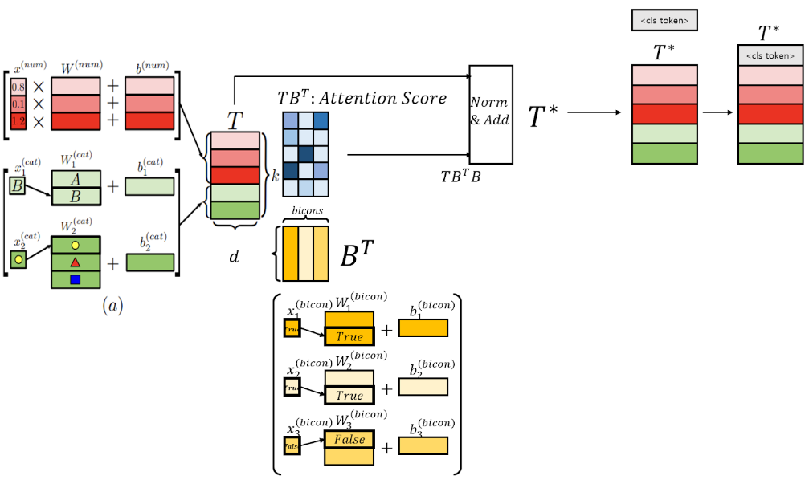
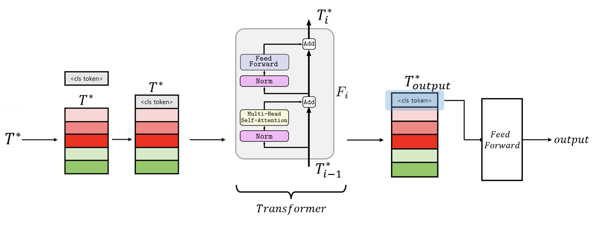

# [Reference Model & Code]
* Yury Gorishniy, Ivan Rubachev, Valentin Khrulkov, Artem Babenko "Revisiting Deep Learning Models for Tabular Data". NIPS2021.
* https://arxiv.org/abs/2106.11959v2
* https://github.com/lucidrains/tab-transformer-pytorch#readme

</img>

Visualize Attention Score to explain how binary condition(bicon) contribute to each tabular feature

</img>

# ToDo
1. Separation of Main Effects from Co-Effects in Binary Conditions
2. => Main Tokens & Interaction Tokens
3. Interaction Tokens => 2^n => Too Many!! => 2~3 Interaction => n^2 ~ n^3 vs 2^n
